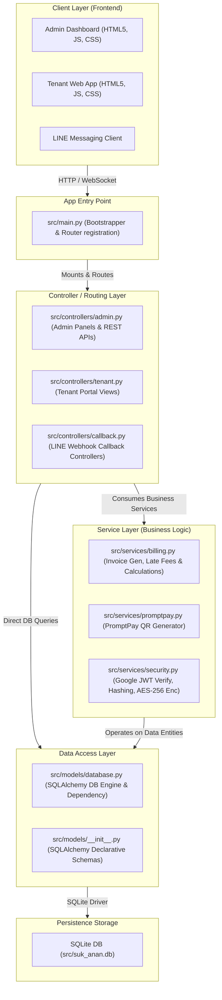
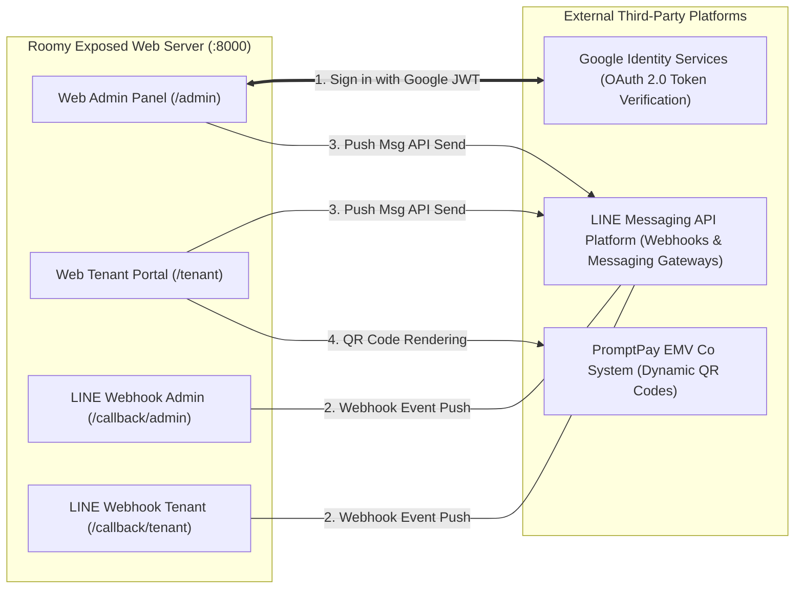
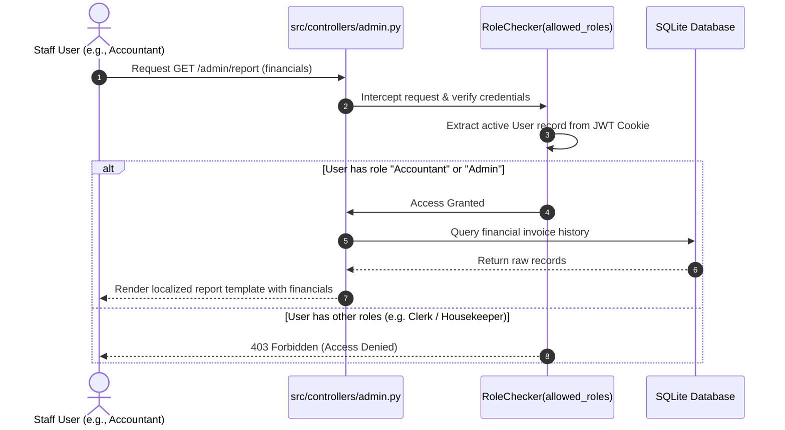
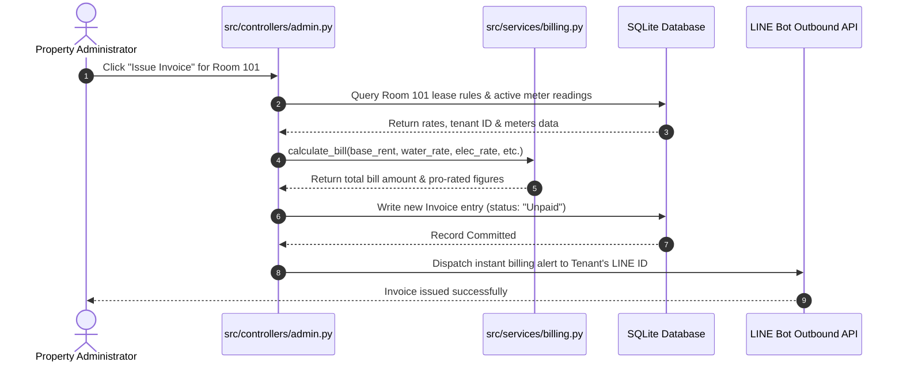

# Roomy - Architectural Analysis & Connection Mapping

This document provides a comprehensive breakdown of the architectural layers, internal module boundaries, and external integration connection points (APIs, webhooks, and third-party systems) exposed by the Roomy application.

---

## 🏗️ Architectural Overview

Roomy is designed as a **Modular Layered Web Architecture** built on top of **FastAPI** (Python). To ensure scalability, testability, and clean separation of concerns, the codebase has been split from a monolithic format into structured service packages.



---

## 🔗 External Connections & Exposed Interfaces

Roomy communicates with several third-party platforms to orchestrate secure sign-ins, automatic payment configurations, and instant messaging push notifications.



### 1. Google OAuth 2.0 Integration
* **Purpose**: Provides secure, zero-password Google Sign-in authentication for administrators and staff members.
* **Flow**:
  1. The client signs in via Google Identity Services button on the browser, producing a secure **ID Token (JWT)**.
  2. The JWT is transmitted to `/admin/setup/bootstrap` or `/admin/login`.
  3. The `src/services/security.py` verifies the token cryptographically against the Google signature keys endpoint: `https://oauth2.googleapis.com/tokeninfo`.
  4. If validated, the database matches the Google account email to register or authenticate the staff member session.

### 2. LINE Messaging Webhooks & Messaging API
* **Purpose**: Exposes endpoints for bidirectional chat, automated notifications, and alert broadcasts.
* **Exposed Callback Interfaces**:
  * `/callback/admin`: Connected to the **Admin LINE Bot**. Handles incoming messages from properties administrators.
  * `/callback/tenant`: Connected to the **Tenant LINE Bot**. Handles incoming tenant queries, maintenance uploads, and registration requests.
* **Messaging Gateway (Outbound)**:
  * Roomy makes outbound HTTP POST requests to the LINE API gateways (`https://api.line.me/v2/bot/message/push` / `broadcast`) to send real-time alerts when billing invoices are issued, maintenance tasks are updated, or verification is completed.

### 3. PromptPay EMV-Co QR Engine
* **Purpose**: Dynamic generation of PromptPay-compliant payment QR codes on invoices for instant scan-to-pay.
* **Implementation**: Uses `src/services/promptpay.py` to compile payment amounts and target national IDs or phone numbers into standard string formats and output clean, zero-dependency payment QR code blocks in the browser.

---

## 📂 Project Directory Structure

```text
d:\Gemini\Project\Roomy\
├── src/
│   ├── controllers/             # HTTP Route handlers and API Routers
│   │   ├── admin.py             # Admin views, Staff CRUD, and settings endpoints
│   │   ├── callback.py          # LINE incoming webhook callback handlers
│   │   └── tenant.py            # Tenant billing, check-in, and repairs views
│   │
│   ├── models/                  # Database schema definitions & persistence layer
│   │   ├── database.py          # DB Engine startup, session generator, dependency
│   │   └── __init__.py          # SQLAlchemy Models (Owner, User, Tenant, Room, Lease, etc.)
│   │
│   ├── services/                # Standalone business logic modules
│   │   ├── billing.py           # Late fees, bill calculator, initial invoice gen
│   │   ├── promptpay.py         # PromptPay EMVCo payment QR generators
│   │   └── security.py          # Google JWT verifier, bcrypt hash, AES-256 encrypter
│   │
│   ├── templates/               # Jinja2 HTML layout components
│   │   ├── dashboard.html       # Super Admin/Staff central application control panel
│   │   ├── bootstrap.html       # Setup wizard and Super Admin claim setup
│   │   ├── receipt_print.html   # Dynamically localized printed invoices & receipts
│   │   └── tenant_portal.html   # Responsive mobile-first tenant dashboard
│   │
│   ├── i18n/                    # Localized Translation JSON records
│   │   ├── th.json              # Thai language translation mappings
│   │   ├── en.json              # English language translation mappings
│   │   └── jp.json              # Japanese language translation mappings
│   │
│   ├── config.py                # Central FastAPI initialization & LINE bot credentials
│   └── main.py                  # Lean application bootstrap and server configuration
│
└── tests/                       # Complete automated unit and integration suite
```

---

## ⚡ Core Business Workflows

### A. Staff Role Verification (RBAC) Flow


### B. Bill Calculation & Invoice Issuance Flow

