# แผนพัฒนาระบบจัดการพัสดุ (Parcel Management System) - ฉบับปรับปรุง

> [!NOTE]
> **สรุปการปรับปรุงตามความต้องการ:**
> 1. **ตัดระบบ QR Code & PIN Code ออก**: ตอนผู้เช่ามารับพัสดุ ไม่ต้องให้ผู้เช่าเปิด QR Code หรือบอกรหัส PIN ให้ยุ่งยาก
> 2. **หลักฐานการรับมอบเป็น Optional**: การแนบรูปถ่ายผู้รับ ลายเซ็น หรือบันทึกชื่อ ให้เป็นทางเลือกเสริม (จะใส่หรือไม่ใส่ก็ได้)
> 3. **ปุ่มบันทึกรับพัสดุสำหรับเจ้าหน้าที่**: เจ้าหน้าที่ค้นหาห้อง/พัสดุ แล้วสามารถกดปุ่ม **"รับพัสดุแล้ว" (Mark as Received)** ได้ในคลิกเดียว

---

## 1. ผังการทำงานของระบบ (Workflow Diagram)

```mermaid
flowchart TD
    subgraph Inward ["1. ขั้นตอนพัสดุมาถึง (Parcel Inward)"]
        A[พัสดุมาส่งที่นิติ/เคาน์เตอร์] --> B[เจ้าหน้าที่เปิดระบบ กรอกเลขห้อง/ขนส่ง/ถ่ายรูป]
        B --> C[ระบบบันทึกสถานะ 'รอรับ' Pending]
        C --> D[LINE OA ส่ง Flex Message แจ้งเตือนผู้เช่าอัตโนมัติ]
    end

    subgraph Pickup ["2. ขั้นตอนผู้เช่ามารับพัสดุ (Simplified Pickup Flow)"]
        E[ผู้เช่ามาติดต่อรับพัสดุ แจ้งเลขห้อง] --> F[เจ้าหน้าที่ค้นหารายการพัสดุในระบบ]
        F --> G{เจ้าหน้าที่กดปุ่ม 'รับพัสดุแล้ว'}
        G -->|ไม่ต้องการแนบหลักฐาน| H[กด 'ยืนยันรับทันที' 1-Click]
        G -->|ต้องการแนบหลักฐาน Optional| I[ถ่ายรูป/ใส่ชื่อผู้รับเพิ่มเติม] --> H
        H --> J[ระบบเปลี่ยนสถานะเป็น 'รับแล้ว' Received พร้อม Timestamp]
        J --> K[ส่งข้อความแจ้งเตือนยืนยันทาง LINE ให้ผู้เช่า Optional]
    end
```

---

## 2. รายละเอียดการทำงานแต่ละส่วน (Feature Specifications)

### 2.1 การรับพัสดุเข้า (Inward Registration)
- **ผู้ใช้งาน:** แอดมิน / เจ้าหน้าที่นิติบุคคล
- **ช่องทาง:** หน้า Admin Backoffice / Dashboard เมนู "จัดการพัสดุ"
- **ข้อมูลที่บันทึก:**
  - อาคาร และ เลขห้อง (เลือกจาก Dropdown / พิมพ์ค้นหา)
  - บริษัทขนส่ง (Flash, Kerry, SPX, J&T, ไปรษณีย์ไทย, อื่นๆ)
  - เลขพัสดุ / Tracking No. (ใส่หรือไม่ใส่ก็ได้)
  - รูปถ่ายพัสดุ (อัปโหลดหรือถ่ายจากมือถือเพื่อให้ผู้เช่าเห็นหน้ากล่อง)
  - หมายเหตุเพิ่มเติม (เช่น ฝากไว้ที่ชั้นวาง A, กล่องขนาดใหญ่)
- **การแจ้งเตือน:** ระบบส่ง LINE Push Notification (Flex Message) ไปยัง LINE ของผู้เช่าที่ผูกกับห้องนั้นอัตโนมัติทันที

---

### 2.2 การส่งมอบพัสดุ (Simplified Pickup - ไม่ใช้ QR / PIN)
- **ขั้นตอนของเจ้าหน้าที่:**
  1. ผู้เช่ามาแจ้งเลขห้อง
  2. เจ้าหน้าที่เปิดหน้ารายการพัสดุ -> กรองดูตามเลขห้อง หรือค้นหาจากชื่อ
  3. พบรายการพัสดุที่สถานะ **"รอรับ (Pending Pickup)"**
  4. กดปุ่ม **"รับพัสดุแล้ว"**
  5. ระบบแสดงหน้าต่างยืนยัน (Confirmation Modal):
     - มีปุ่มใหญ่ **"ยืนยันการส่งมอบ"** ให้กดได้ทันที (รวดเร็วที่สุด)
     - มีช่องเสริม **(ไม่บังคับ - Optional)**:
       - อัปโหลดรูปหลักฐานการรับ (เช่น รูปผู้เช่าถือของ)
       - ชื่อผู้มารับแทน / บันทึกเพิ่มเติม
  6. เมื่อกดยืนยัน สถานะจะเปลี่ยนเป็น **"รับแล้ว (Received)"** พร้อมบันทึกวันเวลาที่รับ (`received_at`) และชื่อเจ้าหน้าที่ผู้ทำรายการ

---

### 2.3 ฝั่งผู้เช่า (Tenant Experience)
- **LINE Notification:** ได้รับการแจ้งเตือนทันทีเมื่อมีพัสดุมาถึง พร้อมรูปถ่ายกล่องพัสดุ
- **Rich Menu / Web View:** เมนู "พัสดุของฉัน"
  - ดูรายการพัสดุคงค้างที่ยังไม่ได้รับ
  - ดูประวัติพัสดุที่รับไปแล้วย้อนหลัง

---

## 3. การออกแบบโครงสร้างฐานข้อมูล (Database Schema)

### ตาราง `parcels`
| ฟิลด์ | ชนิดข้อมูล | คุณสมบัติ | คำอธิบาย |
| :--- | :--- | :--- | :--- |
| `id` | Integer | PK, Auto Increment | รหัสพัสดุ |
| `room_id` | Integer | Foreign Key (`rooms.id`) | รหัสห้องพัก |
| `tenant_id` | Integer | Foreign Key (`tenants.id`), Nullable | รหัสผู้เช่าหลัก (ผูกอัตโนมัติจากห้อง) |
| `carrier` | String(50) | Not Null | บริษัทขนส่ง (เช่น Kerry, Flash, SPX) |
| `tracking_number` | String(100) | Nullable | หมายเลขติดตามพัสดุ |
| `parcel_image_url` | String(255) | Nullable | URL รูปถ่ายพัสดุตอนรับเข้า |
| `status` | String(20) | Default: `'pending'` | สถานะ: `pending` (รอรับ), `received` (รับแล้ว), `cancelled` |
| `arrived_at` | DateTime | Default: `now()` | วันเวลาที่พัสดุมาถึง |
| `received_at` | DateTime | Nullable | วันเวลาที่ผู้เช่ามารับพัสดุ |
| `received_by_name` | String(100) | Nullable | ชื่อผู้มารับ (Optional) |
| `proof_image_url` | String(255) | Nullable | รูปถ่ายหลักฐานตอนส่งมอบ (Optional) |
| `notes` | Text | Nullable | หมายเหตุเพิ่มเติม |
| `created_by_user_id`| Integer | Foreign Key (`users.id`), Nullable | เจ้าหน้าที่ผู้บันทึกรับเข้า |
| `created_at` | DateTime | Default: `now()` | วันเวลาที่สร้างข้อมูล |
| `updated_at` | DateTime | Default: `now()` | วันเวลาที่อัปเดตข้อมูลล่าสุด |

---

## 4. แผนการดำเนินงานพัฒนา (Implementation Roadmap)

1. **Database & Model (CTO / DEV)**
   - เพิ่ม Model `Parcel` ใน SQLAlchemy (`src/models/` และ `src/models.py`)
   - อัปเดตสคริปต์ Migration รองรับทั้ง SQLite และ PostgreSQL

2. **Backend API Endpoints (`src/controllers/admin.py` & `tenant.py`)**
   - `GET /admin/parcels` : รายการพัสดุทั้งหมด พร้อมฟิลเตอร์สถานะ/ห้อง
   - `POST /admin/parcels/create` : บันทึกพัสดุใหม่ + อัปโหลดรูป + ส่ง LINE Push Message
   - `POST /admin/parcels/{parcel_id}/receive` : ปุ่มรับพัสดุ (รองรับแนบ proof หรือไม่แนบก็ได้)
   - `GET /tenant/parcels` : ดึงรายการพัสดุของห้องตนเอง

3. **LINE Integration (Flex Message)**
   - เทมเพลต LINE Flex Message สำหรับแจ้งเตือนพัสดุเข้าพร้อมรูป
   - เมนูดูพัสดุในระบบผู้เช่า

4. **Frontend UI (Dashboard)**
   - เพิ่มแท็บ / เมนู "ระบบจัดการพัสดุ" ในแถบนำทาง Admin
   - การ์ดสรุปยอด: พัสดุรอรับวันนี้, พัสดุรับแล้ว, พัสดุตกค้าง (> 7 วัน)
   - ตารางแสดงรายการพัสดุ พร้อมปุ่มเขียว **"รับพัสดุแล้ว"** และ Modal ยืนยันแบบง่าย

5. **Testing & QA**
   - เขียน Unit & Integration Tests ทดสอบ Flow รับเข้า -> รับออก -> แนบรูป/ไม่แนบรูป -> สิทธิ์ความปลอดภัย -> บันทึก Activity Log
